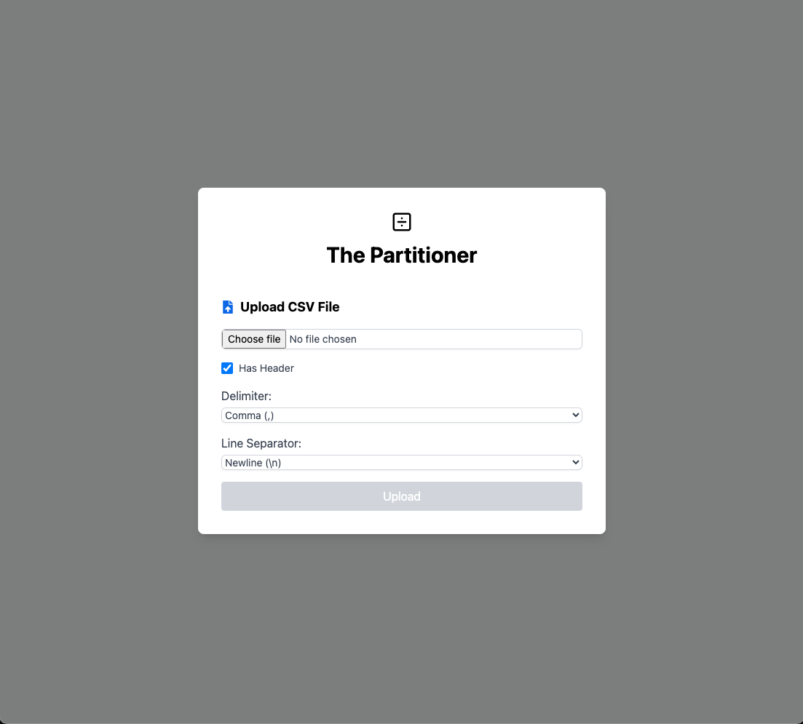
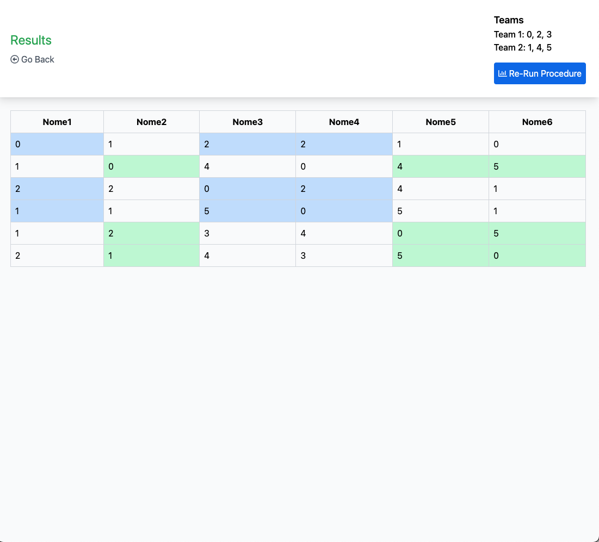

# Group Split App

A web application was developed using React in order to provide a user interface. The app allows to upload a custom CSV file specifying line and row separators. It is also possible to specify whether the first row should be considered as header or not.

A preview of the provided file is then shown and it is possible to execute the procedure on the given matrix. The resulting groups will be highlighted using two different colors.

## Code base structure

- The code that handles CSV parsing is located at `src/utils/csv`
- The code that handles the actual task (partitioning the matrix) is located at `src/utils/partitioning`
- The code that handles the UI is divided in components located at `src/components`
- The app entry point is `src/main.tsx`

## Usage

The app is deployed to GitHub Pages and can be accessed [here](https://canta2899.github.io/is-group-split/).

Otherwise, to run from your local machine you can:

- Clone the repository
- Install packages `npm install`
- Execute `npm run build`
- A `dist` directory will be created containing the app bundle, that can be deployed like any static asset

## How it looks

